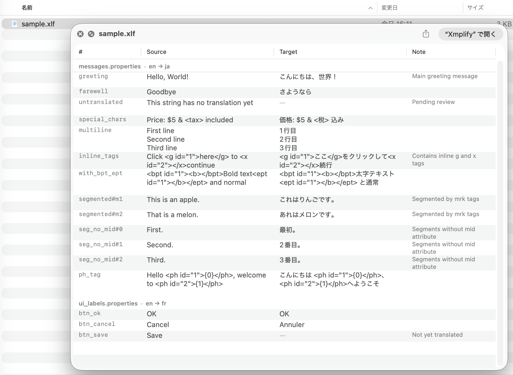

# XLFQL — XLIFF QuickLook Preview Extension

A macOS QuickLook extension that previews XLIFF 1.2 files (`.xlf`, `.xliff`), Phrase TMS mxliff files (`.mxliff`), and SDL Trados Studio sdlxliff files (`.sdlxliff`) directly in Finder by pressing the space bar.

Displays translation units (trans-units) in a grid format with Source, Target, and Note columns.



## Features

- Grid preview of XLIFF 1.2, Phrase TMS mxliff, and SDL Trados Studio sdlxliff files
- Source / Target / Note columns
- Section headers for multiple `<file>` elements
- Segment-level display via `<seg-source>` + `<mrk>` tags
- Inline tag rendering (`<g>`, `<x>`, `<bpt>`, `<ept>`, `<ph>`, etc.)
- Text wrapping with dynamic row heights
- In-cell text selection

## Installation

1. Download `XLFQLApp.app` from [Releases](../../releases)
2. Copy `XLFQLApp.app` to `/Applications`
3. Remove the quarantine attribute (required because the app is unsigned):
   ```bash
   xattr -cr /Applications/XLFQLApp.app
   ```
4. Launch `XLFQLApp.app` once (this registers the extension with macOS)
5. Select a `.xlf`, `.xliff`, `.mxliff`, or `.sdlxliff` file in Finder and press Space to preview

## Uninstallation

1. Move `/Applications/XLFQLApp.app` to Trash
2. Run `qlmanage -r` in Terminal to reset the QuickLook cache

## Building from Source

### Run

1. Open `XLFQLApp.xcodeproj` in Xcode
2. Select the `XLFQLApp` scheme
3. Product → Run (⌘R)

### Export for Distribution

1. Product → Archive
2. Distribute App → Custom → Copy App
3. Distribute the exported `XLFQLApp.app`
